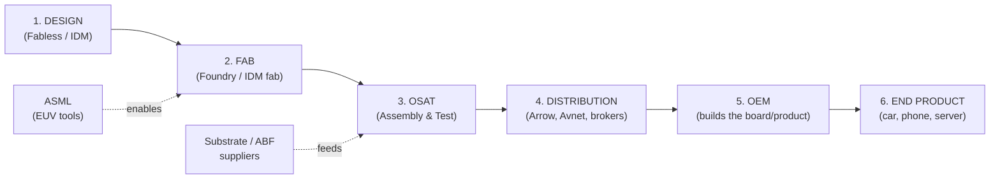

# 🟢 Phase 0 Project — Semiconductor Supply-Chain Domain Map

**Goal:** a one-page mental model of how a chip flows from idea to end product, and
**what data each stage emits** — because that data is the raw material for every AI
system built later in this roadmap.

---

## The Flow

**How to read it:** each box is a stage; a solid arrow (`-->`) means "hands product to
the next stage." The two dotted arrows (`-.->`) are **critical upstream dependencies** —
ASML's machines make the fab possible, and substrate suppliers feed the OSAT. When one
of those hidden inputs is constrained, the whole chain stalls even if everything else
is fine.

---

## What Each Stage Emits (the data that matters for AI)

| Stage | What happens | Data it emits | Structured or unstructured? |
|---|---|---|---|
| **1. Design** (fabless/IDM) | Chip is designed; demand is forecast | Part specs, datasheets, demand forecasts, tape-out schedules | Mixed (specs = docs; forecasts = tables) |
| **2. Fab** (foundry) | Wafers manufactured | Wafer starts, cycle time, **yield**, WIP, capacity & **allocation** notices | Mostly structured (+ allocation letters = docs) |
| **3. OSAT** | Dies cut, packaged, tested | Assembly/test yields, lot tracking, packaging status | Structured |
| **4. Distribution** | Chips bought in bulk & resold | Inventory levels, price quotes, **lead-time** quotes, POs, ASNs, EDI | Structured (EDI) + some docs |
| **5. OEM** | Chips built into a product | Bills of Materials (BOMs), purchase orders, demand signals | Structured |
| **6. End product** | Product sold to customers | Sales/field demand, returns, forecasts feeding back upstream | Structured |

**Cross-cutting signals** (ride alongside the whole chain): supplier emails, **PCNs**
(product change notices), **EOL** (end-of-life) notices, disruption news, and
export-control / regulatory status.

---

## Mini-Glossary

- **IDM** — designs *and* makes its own chips (Intel, Samsung, Micron).
- **Fabless** — designs only; outsources manufacturing (NVIDIA, Apple, AMD).
- **Foundry** — a factory-for-hire that makes others' designs (TSMC).
- **Fab** — the fabrication plant (a foundry is a rentable fab); costs $10–20B to build.
- **OSAT** — outsourced assembly & test; packages and tests the dies (ASE, Amkor).
- **Wafer / die** — chips are printed together on a silicon wafer, then cut into dies.
- **Node** — transistor size in nm; smaller = more advanced & harder to make.
- **Substrate (ABF)** — the tiny board the die sits on; a classic hidden bottleneck.
- **Lead time** — order-to-receipt gap; often 26–52 weeks for chips.
- **Allocation** — in shortages, the fab *assigns* you a quantity rather than selling freely.
- **BOM** — bill of materials; the list of parts that make up a product.
- **EDI** — electronic data interchange; the standard file format for supply-chain B2B data.

---

## Why This Map Matters (the takeaway)

This chain is uniquely fragile for four reasons: **brutal supplier concentration**
(one TSMC, one ASML), **months-long lead times**, **allocation instead of ordering**,
and **geopolitics / export controls**. Trouble is *normal*, and the warning signs are
buried in the data each stage emits above. **Seeing them early is where AI creates
value** — the subject of the next lesson.
